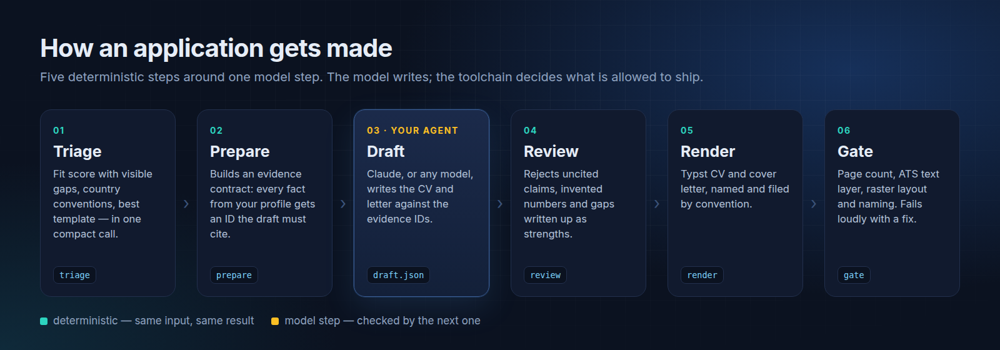
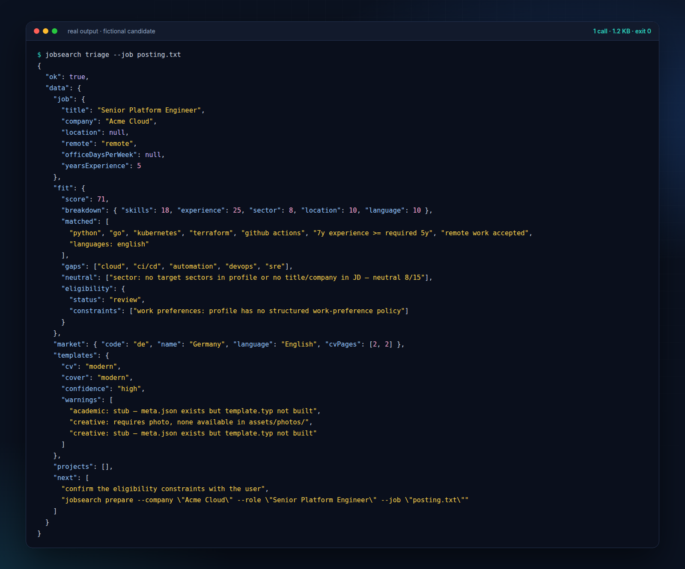
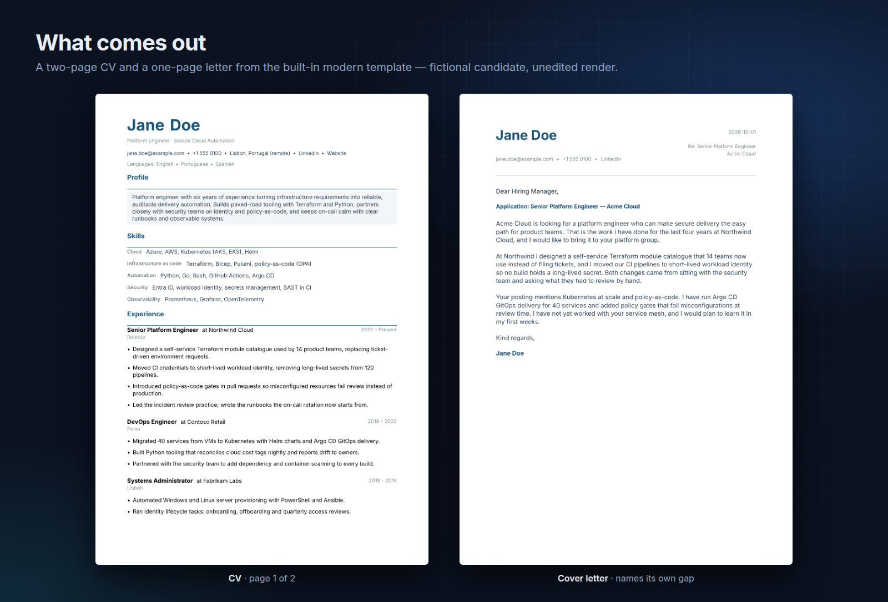
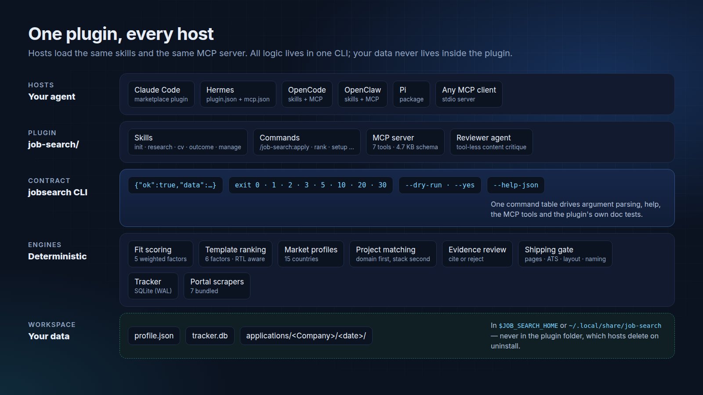

<p align="center">
  
</p>

<p align="center">
  <a href="https://github.com/RohiRIK/jobsearch-plugin/actions/workflows/ci.yml"></a>
  <a href="LICENSE"></a>
  
  
  
  
</p>

<p align="center">
  <a href="#quick-start">Quick start</a> ·
  <a href="#how-it-works">How it works</a> ·
  <a href="#built-for-agents">Agent contract</a> ·
  <a href="#what-you-get">Features</a> ·
  <a href="#documentation">Docs</a>
</p>

---

**jobsearch** turns your AI agent into a careful career assistant. You describe your experience once; for each posting it scores your fit with the gaps left visible, drafts a CV and cover letter that follow the target country's conventions, and refuses to ship anything it cannot trace back to your profile or that fails the document checks.

It is one self-contained plugin for **Claude Code, Hermes, OpenCode, OpenClaw and Pi**, and an MCP server for any other client. The model writes; deterministic TypeScript decides what is allowed out the door.

> [!NOTE]
> Community project, not affiliated with or endorsed by Anthropic or any of the hosts above.

## Why it exists

Asking a chatbot for a tailored CV fails in three predictable ways. **jobsearch** is built around each of them.

| The usual problem | What jobsearch does instead |
|:--|:--|
| The model invents skills, numbers and titles to match the posting. | Every sentence in a draft cites an evidence ID from your profile. `review` rejects uncited claims, numbers that appear nowhere in your profile, and gaps written up as strengths. |
| The PDF looks fine but an applicant-tracking system reads garbage. | The shipping gate extracts the text layer the way an ATS does, checks contact details are literal text, counts pages, and rasterises every page to catch clipping and overlap. |
| One generic CV format for every country. | 15 country profiles (page count, photo, section order, language) drive both template choice and the drafting prompt. The posting always overrides the default. |

## Quick start

**Requirements:** [Bun](https://bun.sh). To compile and gate documents you also need [Typst](https://typst.app) and Poppler (`pdftotext`, `pdfinfo`). `jobsearch status` tells you what is missing.

### Claude Code

```bash
claude plugin marketplace add RohiRIK/jobsearch-plugin
claude plugin install job-search@rohirik
```

Then, inside Claude Code:

```text
/job-search:setup                     # build your profile from a CV, LinkedIn export or notes
/job-search:apply <posting URL>       # triage → draft → review → render → gate
```

### Hermes, OpenCode, OpenClaw, Pi, or any MCP client

```bash
git clone https://github.com/RohiRIK/jobsearch-plugin.git
cd jobsearch-plugin
job-search/scripts/jobsearch hosts-install --host hermes --dry-run   # shows every change first
job-search/scripts/jobsearch hosts-install --host hermes --yes
```

`--host` is one of `hermes`, `opencode`, `openclaw`, `pi` or `mcp`. The installer refuses to overwrite anything it did not create, a second run is a no-op, and `hosts-uninstall` removes only its own changes. Per-host details are in [docs/AGENTS-INTEGRATION.md](docs/AGENTS-INTEGRATION.md).

### Your data

Your profile, tracker and generated documents live in a workspace: `$JOB_SEARCH_HOME`, a repository checkout, or `~/.local/share/job-search`. They are never stored inside the plugin folder, which hosts delete on uninstall. `jobsearch data-where` shows the path and `jobsearch data-backup` copies it.

## How it works

<p align="center"></p>

Only step 3 uses a language model, and its output is checked by step 4. Everything else is deterministic: the same posting and profile give the same score, the same template and the same gate verdict. Each step is a command your agent can call on its own, so a host without the skills can still run the whole flow.

## Built for agents

<p align="center"></p>

The screenshot above is unedited output for a fictional candidate. `triage` returns the job summary, fit score, market conventions, template choice and next step in one call of about 1.2 KB. Before this CLI, the same answer took an agent up to five tool calls and around 13 KB.

Every `jobsearch` command follows the same contract:

- **One JSON envelope on stdout:** `{"ok":true,"data":…}` or `{"ok":false,"error":{code,type,message,recoverable,suggestions}}`. `rank` streams NDJSON. Diagnostics go to stderr only.
- **Exit codes with meaning:** `0` ok · `1` negative verdict · `2` usage or confirmation needed · `3` not found · `5` conflict · `10` dry run · `20` dependency unavailable · `30` internal.
- **Safe writes:** a mutation refuses without `--yes` and previews with `--dry-run`. Over MCP, writes go through a single tool that requires `confirm: true`.
- **Self-describing:** `jobsearch --help-json` prints every command, flag and exit code. The same command table generates the seven MCP tools, so the CLI and MCP never drift apart.

## What you get

<p align="center"></p>

| Area | What's included |
|:--|:--|
| **Find roles** | Portal scrapers for Israel (AllJobs, Drushim, JobMaster), Denmark (Jobindex, Jobbank, Jobnet, Jobdanmark), the EU (Arbeitnow) and remote boards (Remote OK, Remotive, We Work Remotely). Duplicates are dropped across runs, and `rank` scores the batch best-first. [Add your own portal](docs/customization.md). |
| **Assess fit** | A 0–100 score across skills, experience, sector, location and language. Gaps are listed, unknowns score neutral and say so, and eligibility (remote work and office-day limits from your preferences) is reported separately from fit. |
| **Write** | Market-aware CV and cover-letter drafting against an evidence contract. Portfolio projects are matched to the role by domain, so a device-management project does not land on a machine-learning CV. |
| **Ship** | Typst templates on a shared design system, convention-named output (`<Name>_<Company>_<Role>_CV.pdf`), and the four-part gate: page count, ATS text layer, raster layout and naming. |
| **Track** | SQLite application tracker, follow-up reminders, outcome analysis by channel and template, interview prep, and a local dashboard with a REST API. |
| **Operate** | A `manage` skill for health checks, host installs, data backup and migration, efficiency audits and releases, plus the skill factory (`create-skill`, `create-cli-agent`, `create-plugin`). |

**Country conventions:** Israel, Denmark, Sweden, Norway, Germany, Austria, Switzerland, the Netherlands, Belgium, the UK, Ireland, France, Spain, Italy and the US. Inspect any of them with `jobsearch run markets show <code>`.

## Architecture

<p align="center"></p>

- `src/`: shared modules (scoring, templates, markets, project matching, naming, tracker, paths).
- `scripts/`: thin CLIs over those modules.
- `job-search/`: the plugin itself, with skills, commands, manifests for each host, and a prebuilt bundle in `dist/`. The bundle is committed because marketplace installs never run a build, and a test fails if it is out of date.
- `templates/`: Typst CV and cover-letter templates. Each has a `meta.json` that the template engine scores.

[docs/architecture.md](docs/architecture.md) covers the rest.

### Host support

| Host | Packaging | Status |
|:--|:--|:--|
| Claude Code | marketplace plugin: skills, commands, MCP, reviewer agent | Validated with `claude plugin validate --strict`; tested with a clean marketplace install |
| Hermes Agent | `plugin.json` + `mcp.json` | Format checked against Hermes source; installer tested |
| OpenCode | skills + MCP entry in `opencode.json` | Format checked; installer tested |
| OpenClaw | skills + MCP via its CLI | Format checked; installer tested |
| Pi | local package (`package.json`) | Format checked; installer tested |
| Any MCP client | `jobsearch mcp` over stdio | Covered by tests |

"Format checked" means the files match the host's documented format and an installer test passes on a simulated home directory. A live session on that host has not been run yet. Reports from real setups are welcome.

## Development

```bash
bun install
bunx tsc --noEmit        # strict typecheck
bun test tests/          # full suite
bun run gates            # typecheck + tests + bundle freshness + personal-data scan
bun run hooks:install    # run the personal-data scanner and gates before every commit and push
```

After changing anything under `src/`, `scripts/` or `templates/`, run `bun run plugin:build` to refresh the committed bundle. Commits follow [Conventional Commits](https://www.conventionalcommits.org/). Before opening a pull request, run `bun run gates`.

**Never commit personal data.** `data/profile.json`, the tracker, scraped postings and everything under `assets/applications/` are git-ignored. The scanner blocks real emails, phone numbers and LinkedIn URLs in commits; add placeholders to its allow-list rather than weakening a pattern.

## Documentation

| Guide | Contents |
|:--|:--|
| [Usage](docs/usage.md) | Every command, the pipeline and Docker |
| [The apply workflow](docs/apply-workflow.md) | Evidence-grounded drafting, review and the gate, step by step |
| [Agent integration](docs/AGENTS-INTEGRATION.md) | Per-host install, verification and uninstall; MCP and REST reference |
| [Customisation](docs/customization.md) | Adding templates, job portals and salary data |
| [Architecture](docs/architecture.md) | Modules, data flow and state |
| [Setup](SETUP.md) | Prerequisites in detail |
| [Changelog](CHANGELOG.md) | Release history |

## Credits

This project began as a fork of [MadsLorentzen/ai-job-search](https://github.com/MadsLorentzen/ai-job-search) by [Mads Lorentzen](https://github.com/MadsLorentzen), whose original idea and templates it builds on. If it helps you, consider [buying Mads a coffee](https://ko-fi.com/madslorentzen). Bundled fonts and third-party components are listed in [THIRD_PARTY.md](THIRD_PARTY.md).

## License

[MIT](LICENSE). Copyright © 2026 Mads Lorentzen (original project) and Rohi Rikman (the job-search plugin, the `jobsearch` CLI and later changes).
